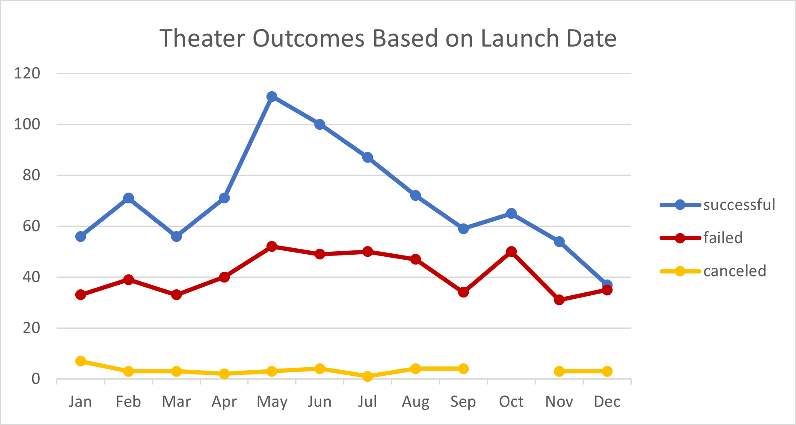
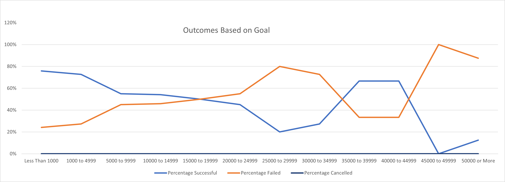

# An Analysis of Kickstart Campaigns
## Overview of Project
Performing analysis on Kickstarter data to uncover trends in relation to cancelled, successful, and failed campaigns. Supporting data includes the goal amounts, launch dates and percentage of successful, failed, and canceled campaigns to futher explain when the best time to launch a new campaign in order to get the most profit.
## Data Analysis
### Outcomes Based on Launch Date
Data for theatre outcomes according to the launch date was input into a table to organize the campaigns according to the theatre genre and what month the campaign occurred. 

### Outcomes Based on Goal
Next, number of successful, failed and canceled projects were pulled from the Kickstarter tab based on their goal amounts and placed in a table for refence. From the pulled data, the percentage of those projects were calculated and an *Outcomes Based on Goal* line chart was made to give an idea of how successful each project was based on their goal amounts.

## Results
### Results on Outcomes Based on Launch Dates
Based on the chart created from the table data for the *Theater Outcomes Based on Launch Date*, it is best to launch a campaign in May or June in order to get the best possible outcome. 
Also, we can assume that September through December seems to be the worst time to launch a campaign, highlighting that in October was the highest in failed campaigns.
### Results on Outcomes Based on Goal
Looking at the *Outcomes Based on Goal* chart, we can conclude that highest successful campaigns have a goal of less than $1000, whereas the lowest successful campaigns lie in the $45,000 to $49,999 goal. 
### Limitations in the Data Set
Insert Here
### Other possible Tables and Graphs 
Insert Here
